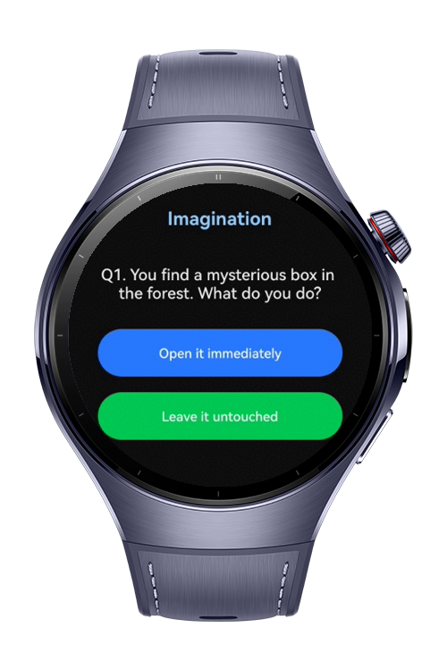
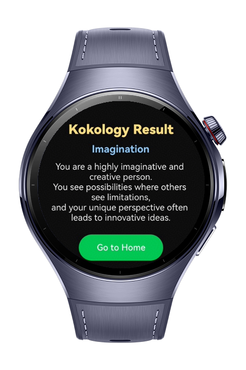

> **Note:** To access all shared projects, get information about environment setup, and view other guides, please visit [Explore-In-HMOS-Wearable Index](https://github.com/Explore-In-HMOS-Wearable/hmos-index).

# Kokology Game

**Kokology Game** is a HarmonyOS-based wearable application that explores personality through psychological questions
and imagination-based choices.  
It presents **6 unique categories**, each containing **5 questions** designed to reveal subconscious traits based on
user selections.

This app demonstrates essential HarmonyOS features such as:

- Page navigation with parameters
- State management using `@State`, `@Consume`, `@Provide`
- MVVM architecture with model & view model usage
- Dynamic list rendering with `ForEach`
- Custom UI for wearable devices

# Preview

<div>



</div>

# Use Cases

- **Personality Quiz**: Each category analyzes a different psychological aspect.
- **A/B Choice System**: Users select between two answers per question.
- **Result Evaluation**: Final personality results are shown dynamically based on choices.
- **Data Transfer with Models**: Safe navigation using `ResultParam` and `GameModel`.

# Technology

## Stack

- **Languages**: ArkTS, ArkUI
- **Frameworks**: HarmonyOS SDK 5.1.0
- **Tools**: DevEco Studio 5.1.0
- **Libraries**:
    - @kit.ArkUI

## Required Permissions

- No need permission.

# Directory Structure

``` 
KokologyGame
|--- entry/src/main/ets/
| |--- model/
| | |--- GameModel.ets
| | |--- ResultModel.ets
| | |--- ResultParam.ets
| |
| |--- viewmodel/
| | |--- GameViewModel.ets
| | |--- ResultViewModel.ets
| |
| |--- pages/
| | |--- HomePage.ets
| | |--- GamePage.ets
| | |--- ResultPage.ets
| | |--- Index.ets
| |
| |--- util/
| | |--- Categories.ets
| | |--- GameData.ets
| | |--- ResultData.ets
| |
| |--- resources/
| |--- screenshots/
``` 

# Constraints and Restrictions

## Supported Device

- Huawei Watch 5

# LICENSE

**Kokology Game** is distributed under the terms of the MIT License.
See the [license](/LICENSE) for more information.